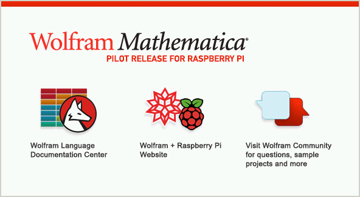
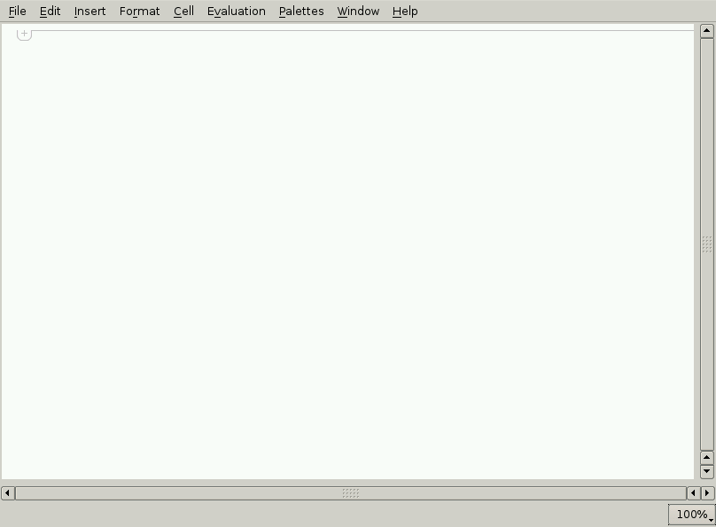

# Stap 1: Starten met Mathematica op een Raspberry Pi

Mathematica vind je onder het menu Education in de app launcher. Indien dit niet het geval is, heb je mogelijk een oude versie (ouder dan medio 2013) van NOOBS op je SD-kaartje staan. In dat geval kan je Mathematica installeren met de volgende commando's:

```bash
sudo apt-get update
sudo apt-get install wolfram-engine
```

Bij het opstarten van Mathematica zal je twee vensters zien verschijnen: Een welkomscherm en een notebook-scherm. Het welkomscherm mag je direct sluiten.





Laten we beginnen met enkele eenvoudige rekensommen in te voeren in het Notebook-scherm:

```bash
2 + 1
2/3 + 1/5
```

Het resultaat van de laatste som is geen kommagetal, maar een breuk. Dit is namelijk de meest exacte weergave van het resultaat. Bij het berekenen van kommagetallen ontstaan afrondingsfouten. 
Soms is het echter handig om het komma-getal te berekenen. Dit doe je als volgt:

```bash
N[2/3 + 1/5]
```

De constante getallen pi en e (het getal van Euler) zitten ook in Mathematica:

```bash
N[Pi, 20]
N[E, 20]
```

Je kan ook met onbekenden rekenen:

```bash
3 + 8a + 20(2+a)
```

