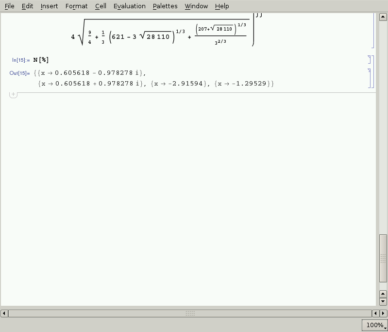

# Stap 2: Functies en lineaire stelsels

## Functies

Mathematica kan je ook gebruiken om te rekenen met functies. Laten we hier eens mee experimenteren. Wat doen de volgende commando's?

```bash
Expand[(x-a)^4]
Expand[(5+x)^3 (x-3)^4]
Simplify[-675 + 405 x + 18 x^2 - 38 x^3 + x^4 + x^5]
```


## Nulpunten van functies berekenen

Je kan ook de nulpunten van een functie berekenen, zoals in de volgende screenshots.


De functie kan ook geplot worden. Daardoor zien we de nulpunten liggen.


Ook functies die geen reële nulpunten hebben, kunnen opgelost worden. Mathematica berekent dan de complexe nulpunten.


Doordat Mathematica liever niet afrondt, kan het resultaat snel een rommeltje lijken.




Wat is het nulpunt van de volgende functies:

```bash
x^3 + 4 x^2 -2x
3x^4 + 6 x^3 + 9 x^2
```

## Afgeleiden en integralen van functies berekenen

De volgende screenshot toont hoe je een afgeleide en een integraal berekent.


Wat is de afgeleide en de integraal van de functies uit de vorige sectie?

## Lineaire stelsels oplossen

Mathematica kan je ook gebruiken om lineaire stelsels op te lossen. Een voorbeelde vind je hieronder.


