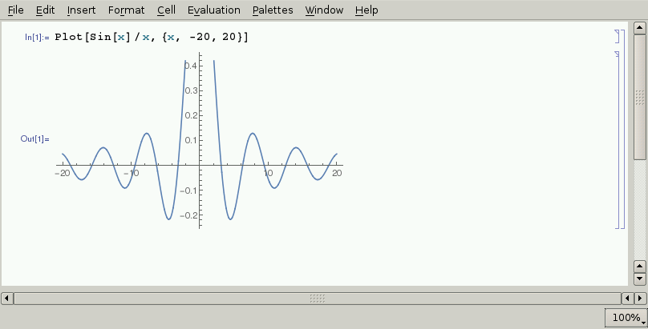
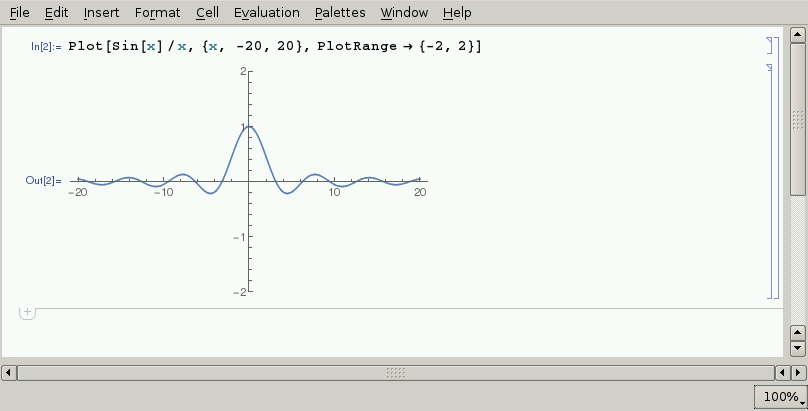
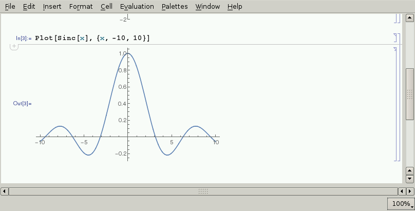
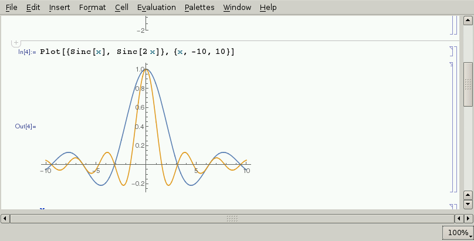
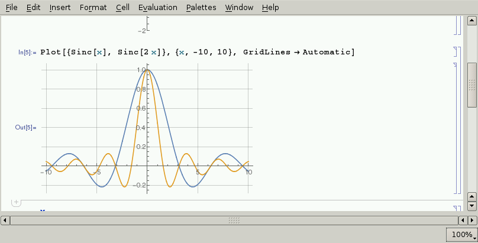
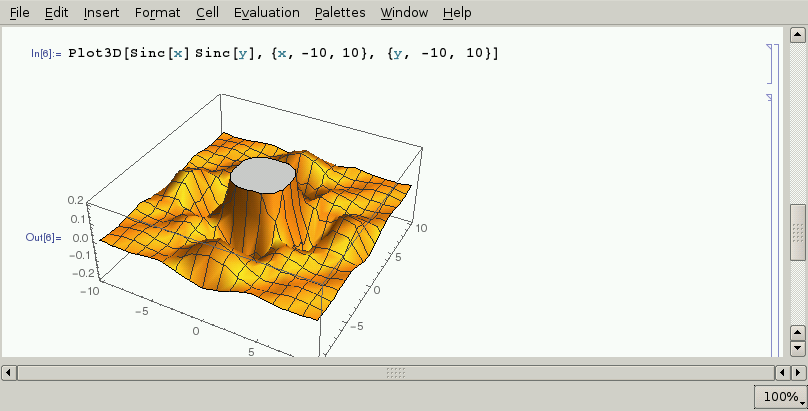
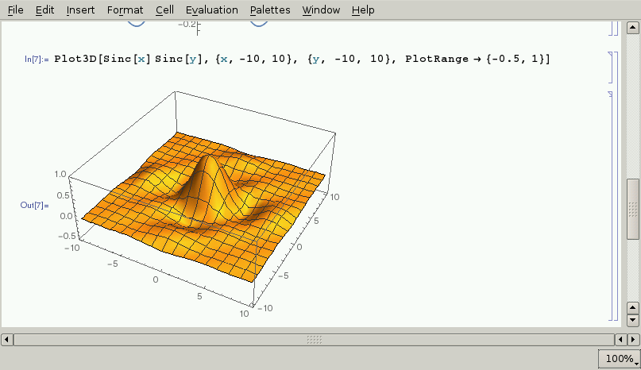
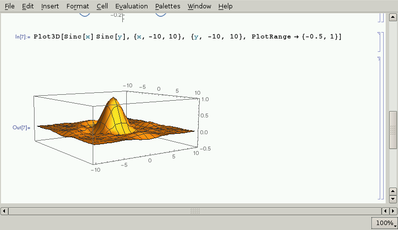
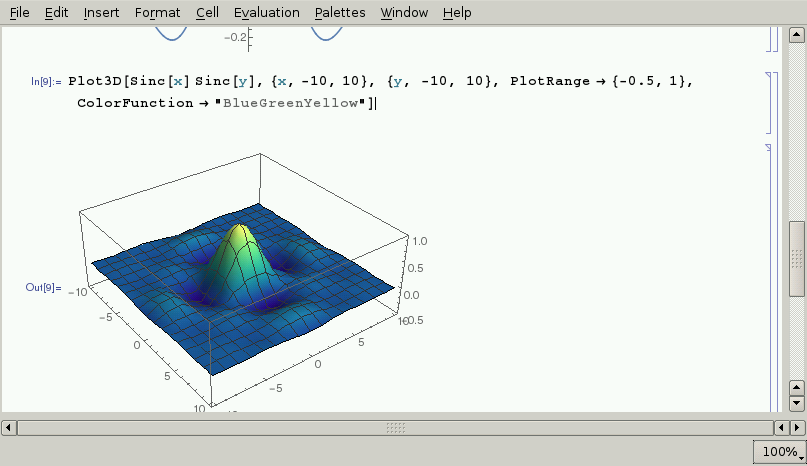
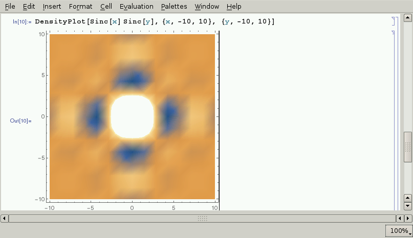

# Stap 3: Plotten van functies

In het vorige deel hebben we al een functie geplot. In dit deel gaan we verder in op de plotfuncties van Mathematica.

Laten we beginnen met sin(x)/x te plotten van -20 tot 20.

Zoals je ziet, staat de functie niet volledig in de figuur. We kunnen het bereik dat we willen plotten op de y-as ook specifiëren met PlotRange:

De functie sin(x)/x wordt ook de sinc functie genoemd. Mathematica kent deze benaming ook.

Meerdere functies plotten op dezelfde figuur gaat als volgt:

Het kan soms handig zijn om een grid toe te voegen aan de figuur.

Je kan functies met twee onbekenden ook in 3D plotten:

Door met je muis op de figuur te slepen, kan je de kijkhoek wijzigen.

Kleuren kan je ook veranderen:

Functies met twee onbekenden kan je ook in 2D plotten. De kleur geeft dan de waarde aan.

