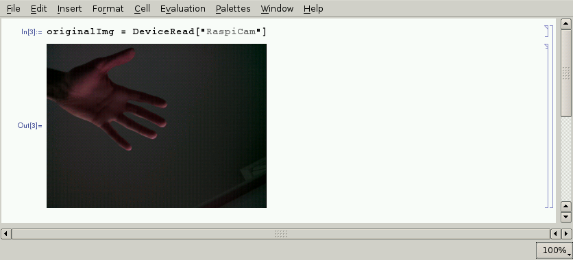
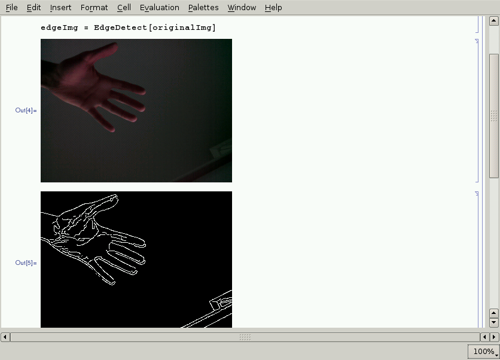

# Stap 4: Foto's nemen met de Raspberry Pi Camera

Vanuit Mathematica kan je de Raspberry Pi camera besturen.

Je kan de foto's die je zo trekt daarna bewerken. Je kan bijvoorbeeld een edge detect uitvoeren.

